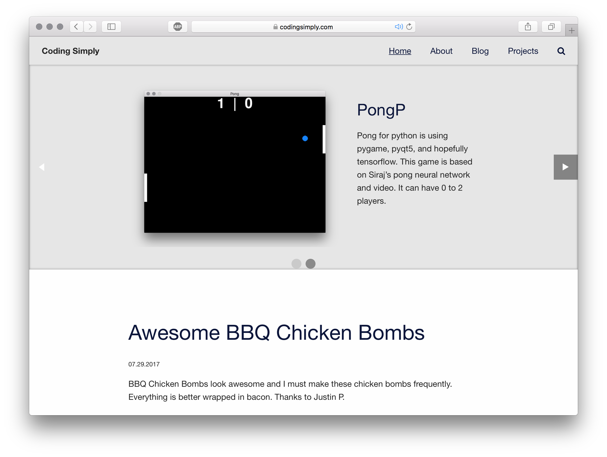

# Coding Simply WP Theme

* Contributors: Adam Saladino
* Requires at least: Wordpress 4.1
* Tested up to: Wordpress 4.8
* License: MIT
* Tags: foundation

## Description
A simple theme with the latest stuff and such.

* Based on foundation

## Installation

1. `git clone`
2. `npm install`
3. `grunt`
4. Copy `build/codingsimply` to your themes folder.